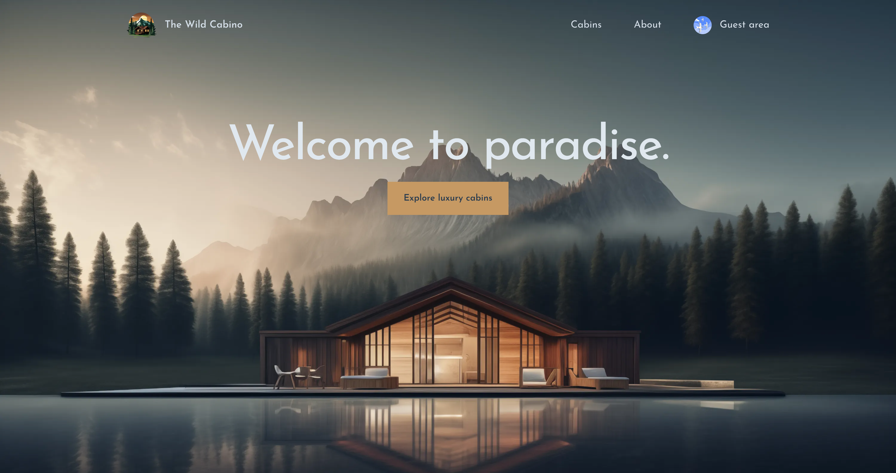
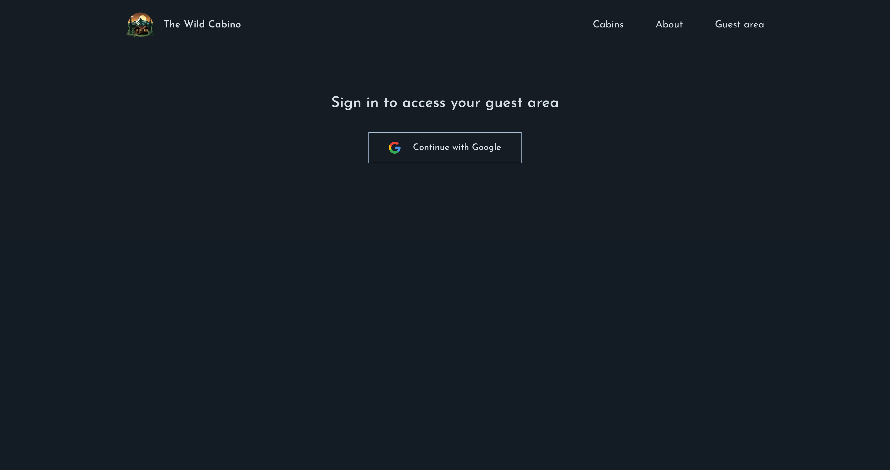
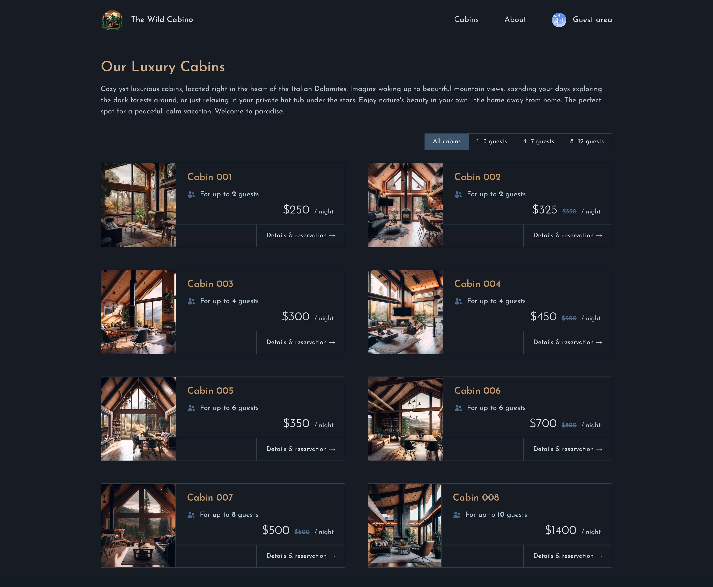
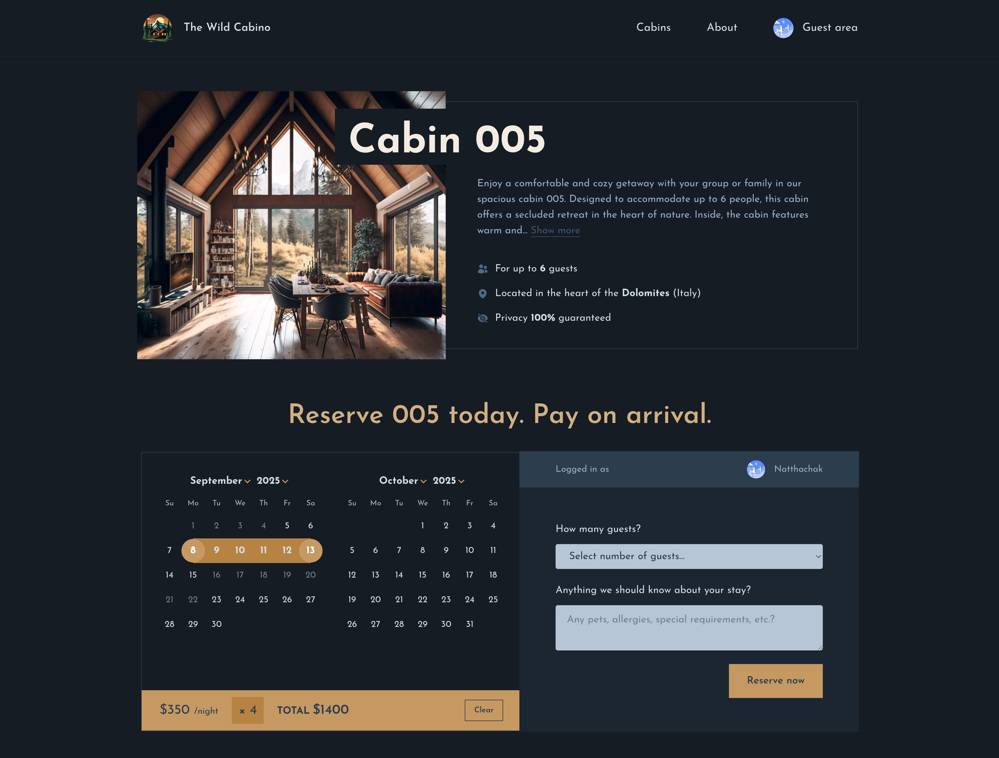
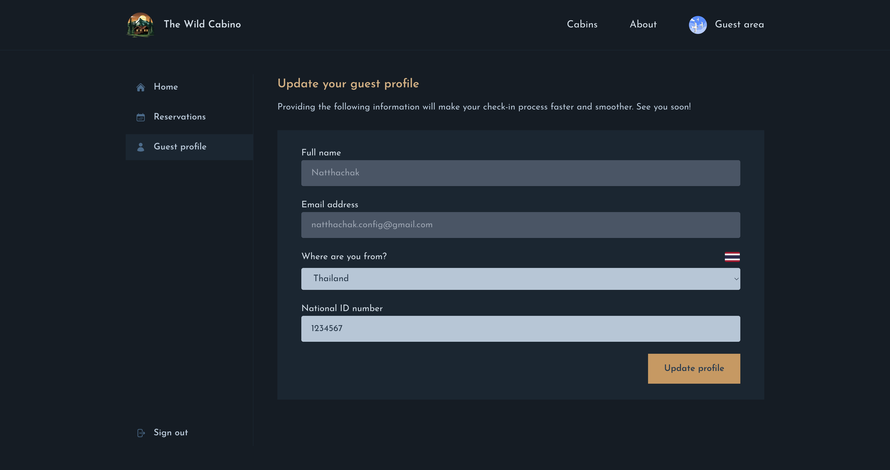
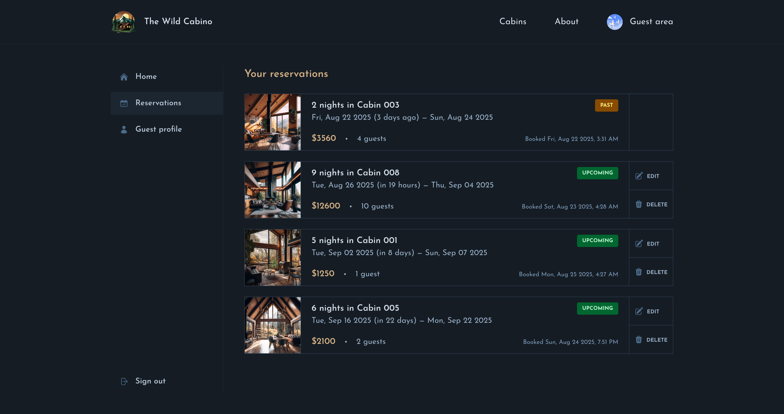

# 🏕️ The Wild Cabino App

A modern full-stack management application built with Next.js 15, Supabase, and TypeScript. This comprehensive booking system enables guests to browse luxury cabins, make reservations, and manage their bookings through an intuitive interface with real-time data synchronization and authentication.

---

## 🌐 Live Demo

👉 [Try the live Application](https://nkieu-wild-cabino.vercel.app/)

---

## 📸 Screenshots

<table>
  <tr>
    <td></td>
    <td></td>
  </tr>
  <tr>
    <td></td>
    <td></td>
  </tr>
  <tr>
    <td></td>
    <td></td>
  </tr>
</table>

---

## ✨ Key Features

### 🏠 Cabin & Booking

- **Cabin Listings** – Browse luxury cabins with advanced filtering by capacity
- **Detailed Cabin Views** – High-quality images, amenities, and pricing information
- **Smart Date Selection** – Interactive calendar with availability checking and pricing calculation
- **Real-time Availability** – Live booking status updates using `Supabase` real-time subscriptions

### 📅 Reservation Management

- **Seamless Booking Flow** – Intuitive multi-step reservation process with form validation
- **Guest Information** – Comprehensive guest profile management with country selection
- **Booking Modifications** – Edit reservations with optimistic UI updates
- **Payment Tracking** – Integration-ready payment status monitoring

### 👤 Authentication & User Management

- **OAuth Integration** – Secure `Google OAuth` authentication with `NextAuth.js`
- **Protected Routes** – Middleware-based route protection for authenticated areas
- **User Profiles** – Complete guest profile management with avatar uploads
- **Session Management** – Persistent authentication with automatic session renewal

### 🎨 Modern User Experience

- **Interactive Components** – Dynamic filtering, date picking, and form interactions
- **Optimistic Updates** – Instant UI feedback using React's `useOptimistic` hook
- **Server Actions** – Modern form handling with Next.js Server Actions

---

## 🧠 Learning Objectives

This application demonstrates mastery of modern Next.js and React patterns:

### ✅ Next.js Features

- **App Router** – File-based routing with layouts, loading states, and error boundaries
- **Server Components** – Optimal performance with server-side rendering and data fetching
- **Server Actions** – Type-safe server mutations without API routes
- **Middleware** – `Route protection` and authentication checks
- **Static Generation** – Pre-rendered cabin pages with `generateStaticParams`
- **Dynamic Metadata** – SEO-optimized page titles and descriptions

### ✅ Advanced React Patterns

- **Server & Client Components** – Proper component boundary management
- **React Hooks** – Custom hooks for reservation context and form handling with `useFormStatus`
- **useOptimistic Hook** – Optimistic UI updates for better user experience
- **Context API** – Global state management for reservation data
- **Compound Components** – Reusable and flexible component compositions

### ✅ TypeScript Integration

- **Type Safety** – Comprehensive `TypeScript` coverage with Supabase generated types
- **Interface Definitions** – Proper typing for props, state, and API responses
- **Generic Components** – Flexible, type-safe component patterns
- **Database Types** – Auto-generated types from Supabase schema

### ✅ Authentication & Security

- **NextAuth.js v5** – Modern authentication with OAuth providers
- **Session Management** – Secure user session handling and persistence
- **Route Protection** – Middleware-based authentication guards
- **Row Level Security** – Database-level access control with `Supabase RLS`

### ✅ Database & Backend Integration

- **Supabase Integration** – Complete BaaS solution with real-time capabilities
- **PostgreSQL** – Relational database with complex queries and joins
- **Storage Management** – File uploads for cabin images and user avatars
- **Real-time Updates** – Live data synchronization across user sessions

### ✅ Performance & Optimization

- **Image Optimization** – Next.js Image component with automatic optimization
- **Bundle Optimization** – Code splitting and dynamic imports
- **Caching Strategies** – Strategic revalidation with `revalidatePath`
- **Loading States** – Proper loading UI with `Suspense` boundaries

---

## 🛠️ Technology Stack

| Technology           | Description                     |
| -------------------- | ------------------------------- |
| **TypeScript**       | Type-safe JavaScript            |
| **Next.js 15**       | React framework with App Router |
| **React 19**         | Latest React with new hooks     |
| **NextAuth.js v5**   | Authentication library          |
| **Supabase**         | Backend as a Service            |
| **Tailwind CSS v4**  | Utility-first CSS framework     |
| **React Day Picker** | Date selection component        |
| **date-fns**         | Modern date utility library     |
| **Heroicons**        | SVG icons library               |

---

## 🚀 Installation & Setup

### Prerequisites

- Node.js 18+ and npm/yarn/pnpm
- Supabase account and project
- Google OAuth credentials

### 1. **Clone the repository**

```bash
git clone https://github.com/nkieu-config/wild-cabino-app-project.git
```

### 2. **Install dependencies**

```bash
npm install
```

### 3. **Environment Setup**

Create a `.env.local` file in the root directory:

```env
# Supabase
SUPABASE_URL=your_supabase_project_url
SUPABASE_KEY=your_supabase_anon_key

# NextAuth
AUTH_SECRET=your_auth_secret
AUTH_GOOGLE_ID=your_google_oauth_client_id
AUTH_GOOGLE_SECRET=your_google_oauth_client_secret

# App URL
NEXTAUTH_URL=http://localhost:3000
```

### 4. **Database Setup**

Set up your Supabase database with the required tables:

```sql
CREATE TABLE cabins
CREATE TABLE guests
CREATE TABLE bookings
CREATE TABLE settings
```

### 5. **Generate TypeScript Types**

```bash
npx supabase gen types typescript --project-id your-project-id > app/_lib/db/database.types.ts
```

### 6. **Start the development server**

```bash
npm run dev
```

Visit [http://localhost:3000](http://localhost:3000) to view your application.

---

## 📚 Course Credit

This project was built as part of **[The Ultimate React Course 2025](https://www.udemy.com/course/the-ultimate-react-course/)** by [Jonas Schmedtmann](https://codingheroes.io/), adapted and enhanced with TypeScript patterns.

---

## 📃 License

This is a personal learning project. Not licensed for commercial use.
